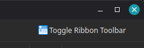

# Ribbon Toolbar

A QGIS plugin that replaces the default menus and toolbars with a Libre Office-like ribbon interface.

**Disclaimer**: this plugin is entirely generated by AI as a proof of concept. Use with caution.

The following screenshot has been created with QGIS 4.2 on Linux Mint using the "Studio Premium" Theme from the [QGIS Studio Themes plugin](https://github.com/GallPeters/qgis-studio-themes). 

## Features

- Tabbed ribbon interface organized by QGIS function category
- Large-icon primary groups for frequently used tools
- Small-icon grid layouts for secondary groups
- Quick-access buttons in the upper left corner
- Main menu access in the upper right corner

## Usage

After installation a **Toggle Ribbon Toolbar** button appears in the QGIS toolbar. Click it to activate the ribbon. Click again to restore the classic interface.

## Author

Anita Graser

pre-0.5 versions by [Eithan Weiss Schonberg](https://github.com/eithanwes/ribbon_toolbar)

